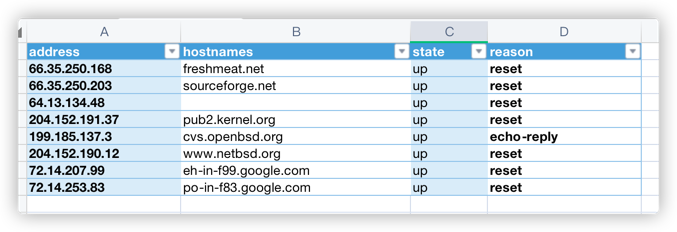
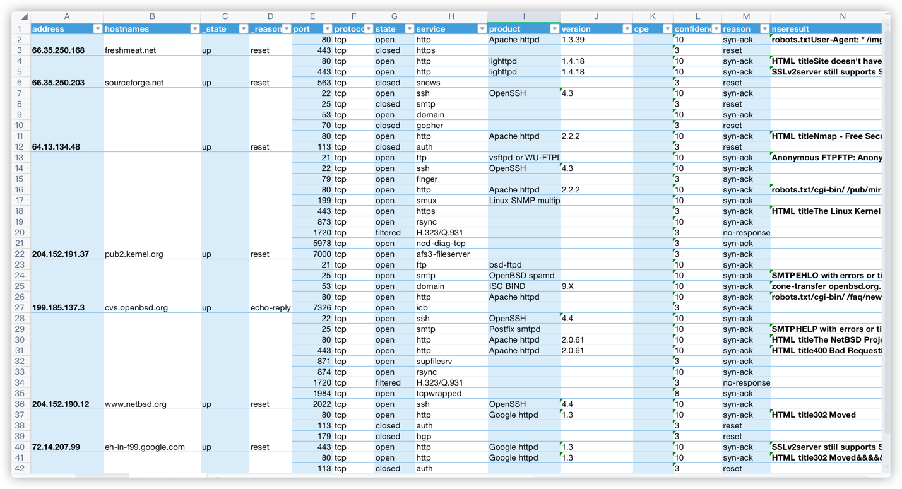

# nmap-go

nmap-go 基于golang的nmap调用库

## 功能

1. 支持几乎所有的nmap原生选项（--iflist还没写）
2. 支持输出中文手册（examples/man）
3. 所有方法均有英文（最新版）的说明
4. 可自定义context进行run（examples/scanwithcontext）
5. 可打印输出包含以下信息的结果

   `address hostnames state reason`

   `port state service version cpe confidence reason nseresult`
6. 可导出hosthint和ip/host的功能5的结果到Excel
7. 导出的Excel结果可合并`address hostnames state reason`
8. 可直接解析xml到Excel（examples/parsewithfile）
9. 包含所有选项的测试案例（nmap/nmap_test.go）
10. 支持生成可执行文件，用于将nmap xml结果解析成Excel（examples/parsexmlresult/main.go）

## 例子

### 基本扫描

```go
package main

import (
	"fmt"
	"github.com/er10yi/nmap-go/nmap"
	"log"
)

// nmap基础扫描
func main() {
	//通过NewNmap()创建nmap
	//AddTargets增加目标，Addp增加端口范围
	scanner := nmap.NewNmap().AddTargets("127.0.0.1").Addp("1-65535")

	//Run运行
	runResult := scanner.Run()

	//获取警告信息
	warn := runResult.WarnOut
	if warn != "" {
		fmt.Printf("warn:\n%s", warn)
	}
	
	//获取错误信息
	err := runResult.ErrOut
	if err != nil {
		log.Fatal("error: ", err)
	}
	
	//获取运行的xml结果
	result := runResult.Result

	//解析xml结果
	parseResult := scanner.ParseXmlResult(result)
	if err != nil {
		log.Fatal(err)
	}
	xmlResult := parseResult.(*nmap.NmapXMLResult)

	//格式化输出xml结果
	scanner.PrettyResult(xmlResult)

	//导出xml结果到Excel
	scanner.ExportResult(xmlResult, "Result")
}

```

### 直接解析xml结果
```go
package main

import (
	"github.com/er10yi/nmap-go/nmap"
	"io/ioutil"
	"log"
)

// nmap 解析xml结果
func main() {
	//通过NewNmap()创建nmap
	scanner := nmap.NewNmap()

	//通过传入string的result，不需要run
	result, err := ioutil.ReadFile("examples/parsewithfile/nmap_example.xml")
	//解析xml结果
	parseResult := scanner.ParseXmlResult(string(result))
	if err != nil {
		log.Fatal(err)
	}
	xmlResult := parseResult.(*nmap.NmapXMLResult)

	//格式化输出xml结果
	scanner.PrettyResult(xmlResult)

	//导出xml结果到Excel
	scanner.ExportResult(xmlResult, "Result")
}
```
执行上面代码的结果输出
```
hosthint:
66.35.250.168 up freshmeat.net 
66.35.250.203 up sourceforge.net 
64.13.134.48 up 
204.152.191.37 up pub2.kernel.org 
199.185.137.3 up cvs.openbsd.org 
204.152.190.12 up www.netbsd.org 
72.14.207.99 up eh-in-f99.google.com 
72.14.253.83 up po-in-f83.google.com 
host and port:
66.35.250.168 up freshmeat.net 
	port     		state     	service             	version                  	cpe	confidence	reason	nseresult
	80/tcp      	open      	http                	Apache httpd 1.3.39                   	[]	10	syn-ack			robots.txtUser-Agent: * /img/ /redir/  &&&& HTML titlefreshmeat.net: Welcome to freshmeat.net
	443/tcp      	closed    	https               	                          	[]	3 	reset			
66.35.250.203 up sourceforge.net 
	port     		state     	service             	version                  	cpe	confidence	reason	nseresult
	80/tcp      	open      	http                	lighttpd 1.4.18                   	[]	10	syn-ack			HTML titleSite doesn't have a title. &&&& robots.txtUser-agent: * /forum /pm /search /softwaremap /top /tracker /users 
	443/tcp      	open      	http                	lighttpd 1.4.18                   	[]	10	syn-ack			SSLv2server still supports SSLv2	SSL2_DES_192_EDE3_CBC_WITH_MD5	SSL2_RC2_CBC_128_CBC_WITH_MD5	SSL2_RC4_128_WITH_MD5	SSL2_RC4_64_WITH_MD5	SSL2_DES_64_CBC_WITH_MD5	SSL2_RC2_CBC_128_CBC_WITH_MD5	SSL2_RC4_128_EXPORT40_WITH_MD5 &&&& HTML titleSite doesn't have a title.			
...省略了部分
```
Excel结果



更多例子可参考`examples`目录下的代码


## 其他

1. 由于方法名需要和nmap参数保持一致，所以有些命名会存在不规范的地方，所有方法都以Add开头，忽略它😄
2. [English comments](https://svn.nmap.org/nmap/docs/nmap.usage.txt)
3. [中文说明来源](https://nmap.org/man/zh/man-briefoptions.html)